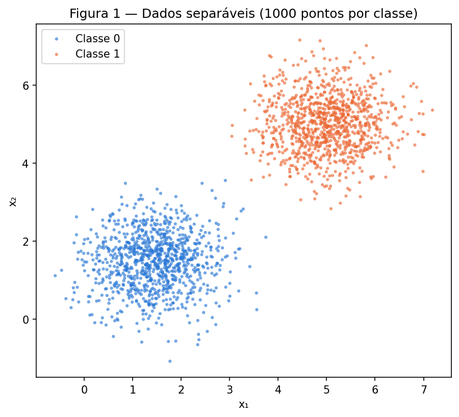
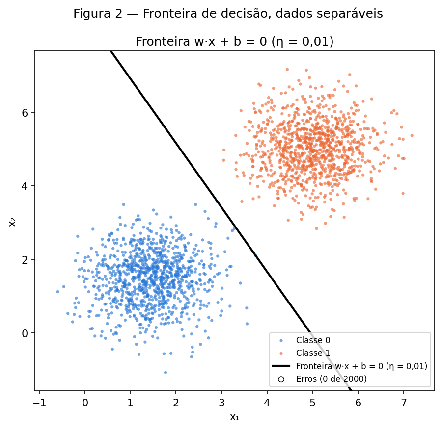
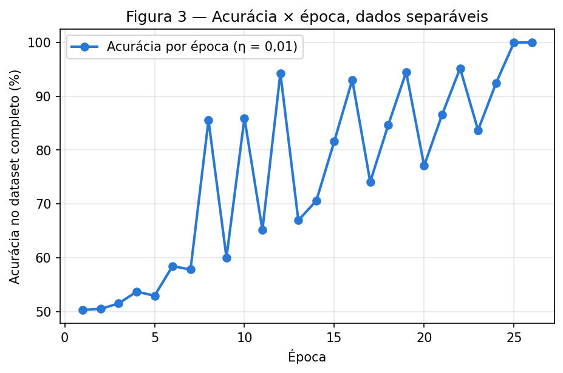
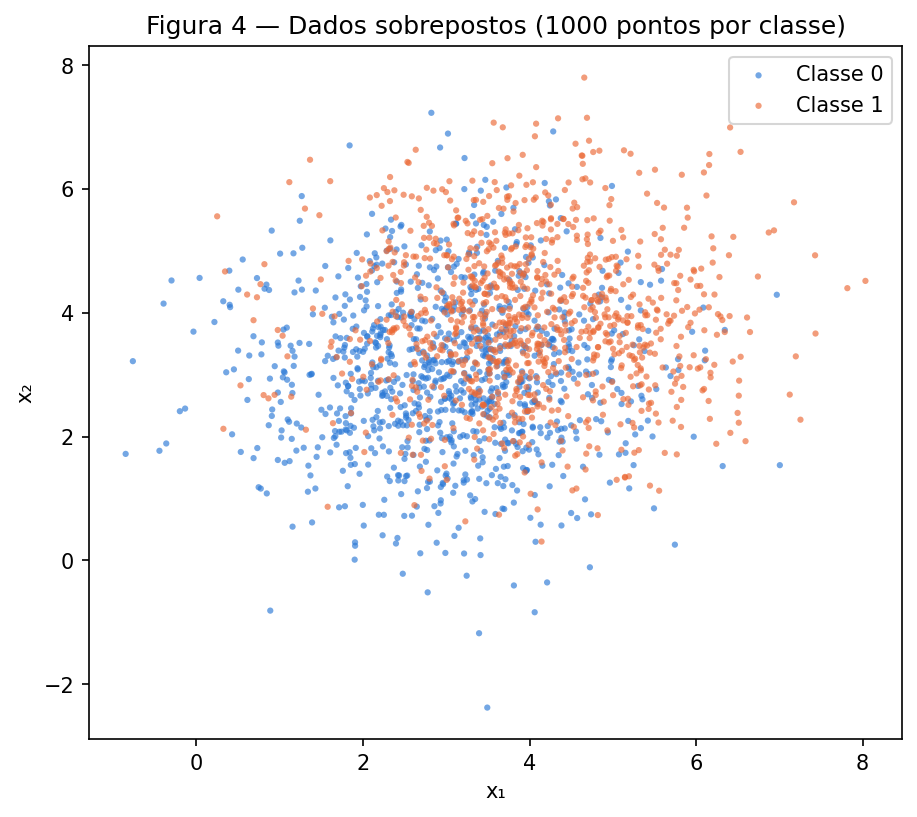
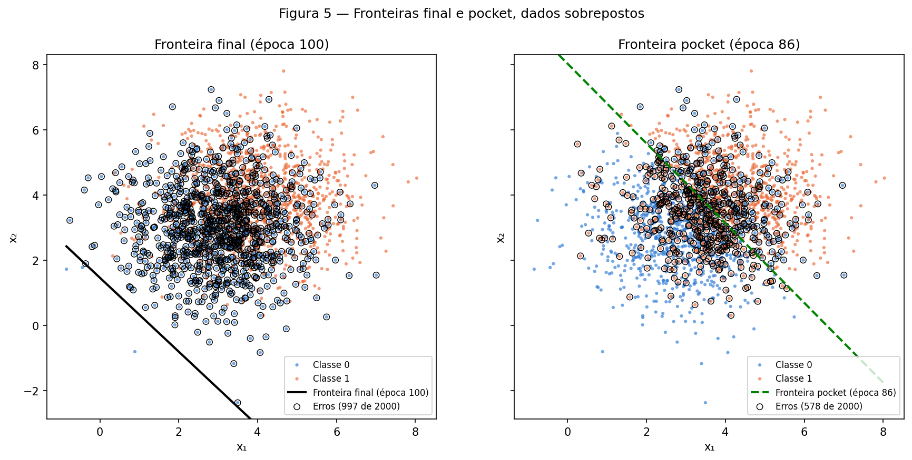
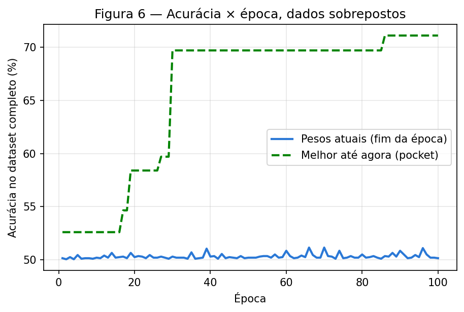

# Perceptron: dados separáveis e dados sobrepostos

O fio condutor do exercício é a separabilidade. O mesmo perceptron, escrito uma única vez, é treinado em dois conjuntos de dados: um que ele resolve e um que ele não resolve. O interessante não é que o segundo falha, mas como falha.

## Abordagem de implementação

Tudo está em um único script, `code/perceptron.py`, executado a partir da raiz do repositório. Ele gera os dois datasets, treina o perceptron, produz as Figuras 1 a 6 em `figures/` e grava todos os números reportados neste texto em `code/results.json`. Um único gerador aleatório, `rng = np.random.default_rng(42)`, é usado na ordem: dados do Exercício 1, inicialização dos pesos, dados do Exercício 2, inicialização dos pesos. Rodar apenas um trecho do script produz sorteios diferentes; a reprodução exige executar o script inteiro.

O perceptron é a função `train`, com a ativação degrau em `step`, a predição em `predict` e a regra de atualização escrita à mão dentro do laço de treino. O algoritmo pocket, usado no Exercício 2, é um `if` de três linhas dentro do mesmo laço: após cada atualização, se a acurácia no dataset completo superar a melhor já vista, os pesos são copiados para o "bolso". Como a função é a mesma nos dois exercícios, o pocket também roda no Exercício 1, onde é inócuo: com dados separáveis os pesos finais são os melhores.

As amostras são apresentadas na ordem em que o dataset foi gerado (as 1000 da classe 0 e depois as 1000 da classe 1), sem embaralhar, como pede o enunciado ("para cada amostra"). Essa ordem importa para interpretar as curvas: a acurácia registrada ao fim de cada época é medida logo depois de o laço passar pelo bloco da classe 1.

Duas decisões merecem registro. Primeiro, a comparação entre as duas taxas de aprendizado no item 1D usa exatamente a mesma inicialização \(\mathbf{w}_0\): o vetor é sorteado uma vez e passado às duas execuções, para que apenas \(\eta\) mude. Segundo, o pocket avalia a acurácia após cada atualização, e não apenas ao fim da época, como o enunciado descreve; isso custa uma passada pelos 2000 pontos por atualização, o que é barato aqui porque o número de atualizações por época é pequeno.

Código completo, comentado:

```python
--8<-- "docs/exercises/perceptron/code/perceptron.py"
```

## Exercício 1

Dados separáveis: o caso para o qual o perceptron foi projetado.

### A — Gere os dados

Foram geradas 1000 amostras por classe de normais bivariadas com covariância \(\begin{bmatrix}0{,}5 & 0\\ 0 & 0{,}5\end{bmatrix}\) nas duas classes, médias \([1{,}5;\,1{,}5]\) para a classe 0 e \([5;\,5]\) para a classe 1. A distância entre as médias, \(\sqrt{2}\cdot 3{,}5 \approx 4{,}95\), é sete vezes o desvio padrão de cada coordenada (\(\sqrt{0{,}5}\approx 0{,}71\)), então as nuvens não se tocam.



**Figura 1.** Dados separáveis, 2000 pontos, uma cor por classe.

### B — Implemente o perceptron

A implementação segue o enunciado. Predição \(\hat y = \operatorname{step}(\mathbf{w}\cdot\mathbf{x}+b)\), com \(\operatorname{step}(z)=1\) se \(z\ge 0\) e \(0\) caso contrário. Para cada amostra \((\mathbf{x}_i, y_i)\):

\[
e_i = y_i - \hat y_i,\qquad \mathbf{w} \leftarrow \mathbf{w} + \eta\, e_i\, \mathbf{x}_i,\qquad b \leftarrow b + \eta\, e_i .
\]

Com rótulos em \(\{0,1\}\) o erro vale \(0\) num acerto (nenhuma atualização), \(+1\) num falso negativo e \(-1\) num falso positivo. Inicialização \(\mathbf{w}_0 \sim \mathcal{N}(0,\,0{,}01^2)\), sorteada com o `rng`, e \(b_0 = 0\). Neste relatório \(\mathbf{w}_0 = [0{,}0025;\ 0{,}0090]\). Taxa \(\eta = 0{,}01\). O treino para quando uma época inteira não produz nenhuma atualização ou em 100 épocas, o que vier primeiro, e a acurácia no dataset completo é registrada ao fim de cada época.

### C — Treine e meça

O treino convergiu em **26 épocas**, com **73 atualizações** no total. Pesos finais:

\[
\mathbf{w} = [0{,}0505;\ 0{,}0289],\qquad b = -0{,}2500,\qquad \text{acurácia final} = 100{,}00\% \ (2000/2000).
\]



**Figura 2.** Fronteira de decisão \(\mathbf{w}\cdot\mathbf{x}+b=0\) sobre os dados. Pontos classificados errado seriam marcados com um anel preto; não há nenhum.



**Figura 3.** Acurácia no dataset completo ao fim de cada época. O serrilhado é efeito da ordem de apresentação: a medida é feita logo após o bloco da classe 1, e nas épocas em que a última correção foi de um falso negativo a fronteira fica momentaneamente empurrada para dentro da classe 0. O serrilhado desaparece quando não há mais atualizações.

### D — Análise

**Por que dados separáveis convergem rápido.** Cada atualização move a fronteira em direção ao ponto errado: um falso negativo soma \(\eta\,\mathbf{x}_i\) a \(\mathbf{w}\), o que aumenta \(\mathbf{w}\cdot\mathbf{x}_i\) em \(\eta\|\mathbf{x}_i\|^2\) e aproxima o ponto do lado correto; um falso positivo faz o oposto. Quando existe uma reta que separa os dados com margem \(\gamma>0\), cada correção também aumenta a projeção de \(\mathbf{w}\) sobre a direção dessa reta, e o teorema de convergência limita o número total de erros por \((R/\gamma)^2\), com \(R\) o raio dos dados. Como o número de erros é finito, os acertos passam a não gerar atualização (\(e_i = 0\)) e as atualizações por época caem até zero, que é justamente o critério de parada. Aqui a contagem por época foi 3, 3, 4, 4, 3, 4, 3, 4, 2, 4, 2, 4, 2, 3, 3, 3, 2, 3, 3, 2, 3, 3, 2, 3, 1 e, na 26.ª, 0. Ela é pequena desde o início porque, com pesos da ordem de \(0{,}01\), o primeiro erro de cada bloco já vira a predição de quase toda a nuvem; o progresso aparece menos na contagem e mais no deslocamento acumulado de \(b\), de \(0\) até \(-0{,}25\), que é o que afasta a fronteira da origem até o corredor entre as classes.

**Nova execução com \(\eta = 1{,}0\).** Sem mudar nada além da taxa (mesmo \(\mathbf{w}_0\), mesmo \(b_0=0\), mesma ordem), o treino convergiu em **37 épocas**, com 101 atualizações, e também chegou a **100,00%** de acurácia. Pesos finais \(\mathbf{w} = [5{,}8706;\ 3{,}3592]\), \(b = -31{,}0\). As direções são quase idênticas:

| Execução | \(\mathbf{w}/\|\mathbf{w}\|\) | \(\|\mathbf{w}\|\) | \(b/\|\mathbf{w}\|\) | Épocas |
|---|---|---|---|---|
| \(\eta = 0{,}01\) | \([0{,}8681;\ 0{,}4963]\) | \(0{,}0582\) | \(-4{,}298\) | 26 |
| \(\eta = 1{,}0\) | \([0{,}8679;\ 0{,}4967]\) | \(6{,}7638\) | \(-4{,}583\) | 37 |

As fronteiras diferem no deslocamento, não na inclinação: a reta com \(\eta = 1{,}0\) fica cerca de \(0{,}29\) unidade mais afastada da origem, isto é, mais próxima da classe 1. O que \(\eta\) controla é o peso da inicialização em relação às atualizações. Cada atualização soma \(\eta\,\mathbf{x}_i\) com \(\|\mathbf{x}_i\|\) entre 2 e 7. Com \(\eta = 1{,}0\) uma única correção soma vetores de magnitude 2 a 7 a pesos de magnitude \(0{,}01\): \(\mathbf{w}_0\) se torna irrelevante a partir do primeiro erro e a trajetória é a de uma partida em zero (a execução em zero, abaixo, tem as mesmas 37 épocas e a mesma contagem de atualizações por época; os pesos finais diferem apenas pelo próprio \(\mathbf{w}_0\)). Com \(\eta = 0{,}01\) cada correção soma \(0{,}02\) a \(0{,}07\), comparável a \(\mathbf{w}_0\), então a inicialização muda quais amostras erram primeiro, a sequência de correções e o ponto onde a reta se estabiliza. Como a função degrau só olha o sinal de \(\mathbf{w}\cdot\mathbf{x}+b\), \(\eta\) não é uma "velocidade de aprendizado" aqui; é só a escala das correções em relação ao ponto de partida.

**Partida em \(\mathbf{w}=\mathbf{0}\), \(b=0\).** Considere duas execuções com a mesma ordem de amostras, uma com taxa \(\eta\) e outra com taxa 1, e chame de \((\mathbf{w}^{(\eta)}_t, b^{(\eta)}_t)\) e \((\mathbf{w}^{(1)}_t, b^{(1)}_t)\) os pesos após \(t\) amostras apresentadas. Afirmo que \(\mathbf{w}^{(\eta)}_t = \eta\,\mathbf{w}^{(1)}_t\) e \(b^{(\eta)}_t = \eta\, b^{(1)}_t\) para todo \(t\). Vale em \(t=0\) porque \(\mathbf{0} = \eta\cdot\mathbf{0}\). Se vale em \(t\), então na amostra seguinte

\[
\operatorname{step}\!\big(\mathbf{w}^{(\eta)}_t\cdot\mathbf{x}+b^{(\eta)}_t\big)
= \operatorname{step}\!\big(\eta\,(\mathbf{w}^{(1)}_t\cdot\mathbf{x}+b^{(1)}_t)\big)
= \operatorname{step}\!\big(\mathbf{w}^{(1)}_t\cdot\mathbf{x}+b^{(1)}_t\big),
\]

porque \(\eta>0\) não altera o sinal de um número (e leva zero em zero, então \(\operatorname{step}(0)=1\) coincide nos dois casos). As duas execuções cometem o mesmo erro \(e\), e

\[
\mathbf{w}^{(\eta)}_{t+1} = \eta\,\mathbf{w}^{(1)}_t + \eta\, e\,\mathbf{x} = \eta\,(\mathbf{w}^{(1)}_t + e\,\mathbf{x}) = \eta\,\mathbf{w}^{(1)}_{t+1},
\qquad
b^{(\eta)}_{t+1} = \eta\, b^{(1)}_t + \eta\, e = \eta\, b^{(1)}_{t+1}.
\]

Por indução, a sequência de erros é a mesma, logo o número de épocas é o mesmo, e a fronteira \(\{\mathbf{x}: \eta(\mathbf{w}\cdot\mathbf{x}+b)=0\}\) é o mesmo conjunto de pontos. A taxa apenas reescala \(\mathbf{w}\) e \(b\) pelo fator \(\eta\). O script confere isso numericamente: partindo de zero, \(\eta = 0{,}01\) dá \(\mathbf{w} = [0{,}0587;\ 0{,}0335]\), \(b = -0{,}31\) em 37 épocas, e \(\eta = 1{,}0\) dá \(\mathbf{w} = [5{,}8681;\ 3{,}3503]\), \(b = -31\) em 37 épocas; a razão é \(100{,}0000\) nas duas componentes de \(\mathbf{w}\) e em \(b\). É por isso que o item B proíbe a partida em zero: ela tornaria a comparação entre taxas vazia. A inicialização com \(\mathcal{N}(0,\,0{,}01^2)\) quebra a proporcionalidade porque \(\mathbf{w}_0 \neq \eta\,\mathbf{w}_0\).

## Exercício 2

Dados sobrepostos: o caso que o perceptron não resolve.

### A — Gere os dados

Novamente 1000 amostras por classe, agora com médias \([3;\,3]\) e \([4;\,4]\) e covariância \(\begin{bmatrix}1{,}5 & 0\\ 0 & 1{,}5\end{bmatrix}\) nas duas classes. A distância entre as médias, \(\sqrt{2}\approx 1{,}41\), é pouco mais de um desvio padrão (\(\sqrt{1{,}5}\approx 1{,}22\)), e a variância é o triplo da do Exercício 1. As nuvens se sobrepõem em quase toda a extensão; nenhuma reta separa as classes.



**Figura 4.** Dados sobrepostos, 2000 pontos, uma cor por classe.

### B — Treine guardando os melhores pesos

A função `train` do Exercício 1 foi reutilizada sem alteração, com \(\eta = 0{,}01\), \(\mathbf{w}_0 \sim \mathcal{N}(0,\,0{,}01^2)\) e o teto de 100 épocas. Como esperado, nenhuma época terminou sem atualizações e o laço foi até o teto, com 289 atualizações no total (entre 2 e 5 por época).

| Conjunto | \(\mathbf{w}\) | \(b\) | Acurácia | Época |
|---|---|---|---|---|
| Pesos finais (após a época 100) | \([0{,}0545;\ 0{,}0480]\) | \(-0{,}0700\) | **50,15%** (1003/2000) | 100 |
| Pesos do pocket (melhores vistos) | \([0{,}0107;\ 0{,}0087]\) | \(-0{,}0700\) | **71,10%** (1422/2000) | 86 |

Os pesos finais predizem classe 1 para 99,85% dos pontos: o resultado é o de um chute. Não é um defeito do código; o item D explica.

### C — Figuras



**Figura 5.** As duas fronteiras sobre os dados, uma por painel, com os pontos classificados errado marcados por um anel preto. À esquerda, a fronteira final, fora da nuvem, erra 997 pontos; à direita, a fronteira do pocket, que atravessa a região de sobreposição, erra 578.



**Figura 6.** Acurácia dos pesos correntes ao fim de cada época e melhor acurácia vista até então (pocket). A curva corrente fica presa entre 50,05% e 51,15% durante as 100 épocas. O pocket sobe em degraus (52,60% na época 1; 58,40% na 19; 69,70% na 30; 71,10% na 86) e não muda depois.

### D — Análise

**A diferença entre 50,15% e 71,10%.** As duas retas têm quase a mesma inclinação (direções \([0{,}750;\ 0{,}661]\) e \([0{,}774;\ 0{,}633]\), ambas próximas da direção \([1;\,1]\) que liga as médias); o que muda é onde a reta está. A distância com sinal da origem à reta é \(b/\|\mathbf{w}\|\): \(-0{,}96\) para a final e \(-5{,}08\) para o pocket. O centro da nuvem, \([3{,}5;\,3{,}5]\), está a \(4{,}95\) da origem. A reta do pocket passa pelo meio da nuvem, entre as duas médias (\(\mathbf{w}\cdot\boldsymbol{\mu}+b\) vale \(-0{,}012\) na média da classe 0 e \(+0{,}008\) na da classe 1). A reta final está a uma unidade da origem, no canto inferior esquerdo, do lado de fora da nuvem: \(\mathbf{w}\cdot\boldsymbol{\mu}+b\) vale \(+0{,}24\) e \(+0{,}34\) nas duas médias, ambos positivos, então praticamente tudo é classificado como 1.

O laço deixa a reta ali por causa da regra de atualização. Cada erro move \(b\) em \(\eta = 0{,}01\), mas move \(\mathbf{w}\) em \(\eta\,\mathbf{x}_i\), com \(\|\mathbf{x}_i\| \approx 5{,}1\) em média neste dataset, ou seja, cinco vezes mais. O efeito sobre a pontuação \(\mathbf{w}\cdot\mathbf{x}+b\) de um ponto típico é ainda mais desigual: a parcela de \(\mathbf{w}\) muda em \(\eta\,\mathbf{x}_i\cdot\mathbf{x} \approx 0{,}01\cdot 26 \approx 0{,}26\), e a de \(b\) em \(0{,}01\). Um único erro basta para virar o sinal da pontuação de quase toda a nuvem, porque as pontuações são da ordem de \(0{,}3\). É por isso que há só 2 a 5 atualizações por época: o primeiro erro do bloco da classe 0 vira tudo para 0, o primeiro erro do bloco da classe 1 vira tudo para 1, e o resto do bloco passa "certo". Depois de 289 atualizações, \(b\) acumulou apenas \(-0{,}07\), e a reta \(\mathbf{w}\cdot\mathbf{x} = 0{,}07\) fica perto da origem, longe do centro dos dados, onde \(|\mathbf{w}\cdot\mathbf{x}|\) já vale \(0{,}3\). Como o bloco da classe 1 é o último de cada época, a última correção de toda época é um falso negativo, que soma \(+\eta\,\mathbf{x}_i\) e deixa \(\mathbf{w}\) apontando para a nuvem; a fronteira final é sempre a versão "tudo é 1". O pocket capturou o instante, na época 86, em que \(\|\mathbf{w}\|\) ficou pequeno (\(0{,}0138\)) o bastante para \(b = -0{,}07\) pesar e empurrar a reta para dentro da nuvem, com a orientação certa. Os 71,10% ficam perto do teto de uma reta para estas duas gaussianas, que é \(\Phi\big(\tfrac{\sqrt 2/2}{\sqrt{1{,}5}}\big)\approx 71{,}8\%\) em expectativa.

**Figura 3 versus Figura 6.** No Exercício 1 a curva se estabiliza em 100% e o laço para; aqui a curva corrente oscila entre 50,05% e 51,15% por 100 épocas sem tendência, e só o pocket melhora. O teorema de convergência do perceptron garante que, se existir um hiperplano que separa os dados com margem \(\gamma>0\) e os dados estão num raio \(R\), o algoritmo comete no máximo \((R/\gamma)^2\) erros e depois nunca mais atualiza, qualquer que seja \(\eta\). A hipótese violada é a existência do hiperplano separador: para este dataset a melhor reta acerta cerca de 72%, então não há \(\gamma>0\), o limite \((R/\gamma)^2\) não existe e nada impede a sequência de erros de continuar indefinidamente, que é o que a Figura 6 mostra.

**Mais épocas ou \(\eta\) menor?** Nenhum dos dois. Mais épocas não ajudam porque a regra não tem memória nem noção de melhora: cada erro produz sempre o mesmo salto \(\eta\,e_i\,\mathbf{x}_i\), independentemente de quantas épocas se passaram, e como qualquer reta erra pelo menos cerca de 560 pontos, sempre há erros e os pesos nunca param de se mover. As 100 épocas registradas já mostram o regime estacionário: a contagem de atualizações por época e a acurácia ao fim da época não têm tendência alguma entre a época 1 e a 100. Um \(\eta\) menor também não ajuda, pela álgebra do item 1D: a partir de uma partida em zero, \(\eta\) apenas reescala \(\mathbf{w}\) e \(b\), preservando a sequência de erros e as fronteiras; a partir de \(\mathbf{w}_0\neq\mathbf{0}\), a diferença some assim que as correções acumuladas dominam \(\mathbf{w}_0\), o que acontece em poucas atualizações, e daí em diante a trajetória volta a ser a da partida em zero, reescalada. Em particular a razão entre o passo de \(b\) e o passo de \(\mathbf{w}\), \(\eta / (\eta\|\mathbf{x}_i\|) = 1/\|\mathbf{x}_i\|\), não depende de \(\eta\): o desequilíbrio que deixa a fronteira fora da nuvem é o mesmo em qualquer escala. Como o degrau só enxerga o sinal de \(\mathbf{w}\cdot\mathbf{x}+b\), reduzir a escala não muda nenhuma predição. O que resolve dados sobrepostos não é mais treino, e sim outro critério: guardar o melhor (pocket) ou trocar o degrau por uma perda que penalize a distância à fronteira, o que o perceptron não faz.

## Resumo dos resultados

| # | Quantidade | Valor |
|---|---|---|
| 1 | Exercício 1 — \(\mathbf{w}\) e \(b\) finais | \(\mathbf{w} = [0{,}0505;\ 0{,}0289]\), \(b = -0{,}2500\) |
| 2 | Exercício 1 — épocas até convergir | 26 |
| 3 | Exercício 1 — acurácia final | 100,00% (2000/2000) |
| 4 | Exercício 1 — épocas e acurácia final com \(\eta = 1{,}0\) | 37 épocas, 100,00% (\(\mathbf{w} = [5{,}8706;\ 3{,}3592]\), \(b = -31{,}0\)) |
| 5 | Exercício 2 — \(\mathbf{w}\) e \(b\) finais | \(\mathbf{w} = [0{,}0545;\ 0{,}0480]\), \(b = -0{,}0700\) |
| 6 | Exercício 2 — acurácia dos pesos finais | 50,15% (1003/2000) |
| 7 | Exercício 2 — acurácia dos pesos do pocket | 71,10% (1422/2000), \(\mathbf{w} = [0{,}0107;\ 0{,}0087]\), \(b = -0{,}0700\) |
| 8 | Exercício 2 — época em que o melhor do pocket ocorreu | 86 |

Todos os valores estão em `code/results.json` e são reproduzidos por `python docs/exercises/perceptron/code/perceptron.py` a partir da raiz do repositório, com `numpy==2.4.3` e `matplotlib==3.10.9` (ver `requirements.txt`).
